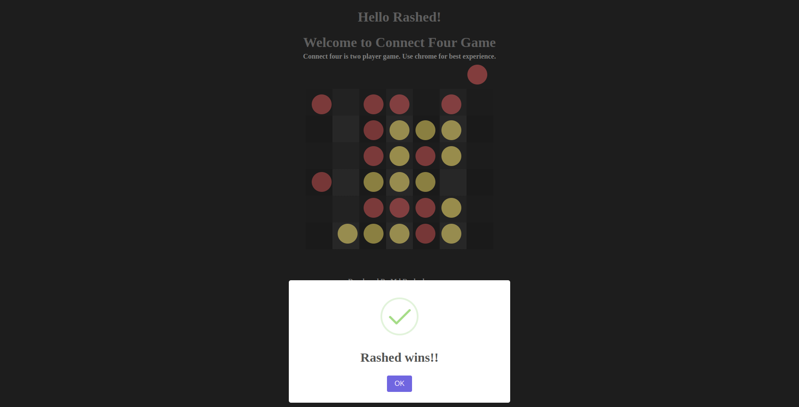

# Connect Four Game using HTML, CSS, and JavaScript

A simple web-based implementation of the classic Connect Four game using HTML, CSS, and JavaScript.

# Live

## How to Play

1. Open the `index.html` file in a web browser to start the game.

2. Players take turns dropping their pieces into the columns of the game board.

3. The first player to connect four of their pieces vertically, horizontally, or diagonally wins the game.

4. Click on any column to drop a piece. The piece will fall to the lowest available position in the column.

5. The game ends when one player wins or the entire board is filled with pieces.

## Features

- Two-player gameplay.
- Visual indication of player turns using red and yellow pieces.
- Dynamic game board that updates with each move.
- Win detection for vertical, horizontal, and diagonal connections of four pieces.
- Prevents further moves once a player wins.

## Technologies Used

- HTML: Structure of the game board and user interface.
- CSS: Styling and visual presentation of the game.
- JavaScript: Game logic, interactivity, and win detection.

## Acknowledgments

This Connect Four game is inspired by the classic board game. It was developed as a simple project to practice web development skills.

## Author

Developed By [Md Rasheduzzaman](https://github.com/jmrashed)

## License

This project is licensed under the [MIT License](LICENSE).
